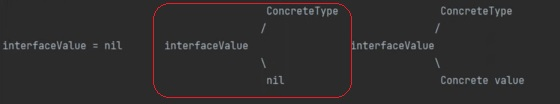

Что выведет программа? Объяснить вывод программы. Объяснить внутреннее устройство интерфейсов и их отличие от пустых интерфейсов.

```go
package main

import (
	"fmt"
	"os"
)

func Foo() error {
	var err *os.PathError = nil
	return err
}

func main() {
	err := Foo()
	fmt.Println(err)
	fmt.Println(err == nil)
}
```

Ответ:
```
<nil>
false
```




error - это интерфейс

Переменная err содержит в себе:
* тип `*fs.PathError`

* значение `nil`

При этом переменная не считается равной `nil`. Во время сравнения `err == nil` ожидаемо получаем `false`. (так как содержит тип).

Когда выводим переменную на консоль `fmt.Println(err)`, выводим само значение - `nil`.


